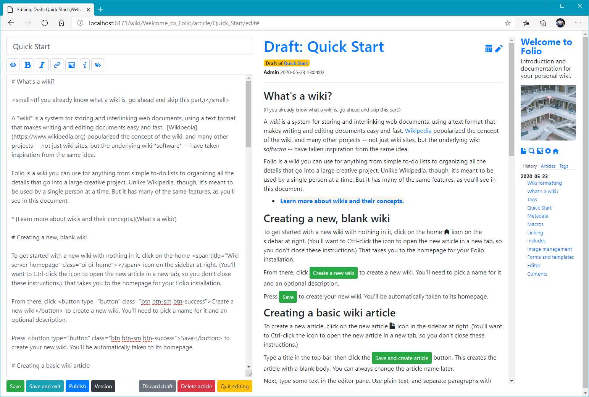

**Folio** is a personal wiki, using Python 3.7+. It's somewhat akin to [TiddlyWiki](https://tiddlywiki.com/), in that it's intended for single-user use.

> This project is still in the early alpha stages and very unstable. Data is not guaranteed to be compatible across releases while in alpha. **Do not use it for production work of any kind,** at least not without making regular backups.

Folio uses Markdown to render text, with some gratuitous additions for things exclusive to Folio (e.g., links within a wiki).

The application runs from a single directory, using SQLite as a database, and so is entirely portable.

# Features

* Easy cross-linking between articles (use `[[double square brackets]]` to link directly to an article by name; use `[Markdown link](link)` format to link to a URL)
* Images (and later, broader support for multimedia like videos)
* Article tagging
* Arbitrary metadata for articles, wikis, multimedia
* Full-text search
* Article versioning

# Quickstart

If you're on Windows 10, you can [download a pre-packaged binary from the releases list](https://github.com/syegulalp/folio/releases), unpack the archive into a directory with write permissions, and run `folio.bat`. Note that you may need to unblock the .ZIP file to unpack it properly.

For other OSes:

1. You'll need Python 3.7 or better.
2. Download or clone the repository, and place it in a directory where you have write permissions.
3. Install the requirements.
4. Run `python folio` to start the program. The system web browser will automatically launch to the newly configured home page for the wiki.
5. The subdirectory `data` will contain the data for the wiki, which can be backed up or restored as needed.
6. To shut the wiki down, either terminate the running Python session or navigate to the URL `/quit` in the wiki.

## To do

Quite a lot, but mainly:

* A proper test suite
* Export and import
* More sophisticated and configurable page styling options

## Later

* Plugins
* Multi-user support

# Copyrights and licensing

Folio is available under the terms of the MIT License.

This project relies on the following third-party packages:

* [Open Iconic](https://github.com/iconic/open-iconic) (SIL Open Font License / MIT License)
* [Python-Markdown](https://github.com/Python-Markdown/markdown/) (BSD-like license)
* [Peewee](https://github.com/coleifer/peewee/) (MIT license)
* [Bootstrap](https://getbootstrap.com/docs/4.0/about/license/) (MIT license)
* [jQuery](https://jquery.org/license/) (MIT license)

The default cover image is from [Gabriel Sollman / Unsplash.](https://unsplash.com/photos/Y7d265_7i08)